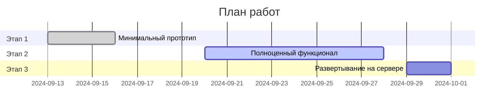

## Предложение

Я предлагаю реализацию проекта в три этапа с проведением тестирования и внесением правок после каждого этапа (занимает дополнительно 2-4 дня).

### Этап 1: Минимальный прототип (13.09 → 19.09)

- Разработка ведется на моем тестовом сервере.
- Реализуемые функции:
  - Телеграм-бот.
  - Подключение к базе данных.
  - Команда `/start` — выводит описание бота и ссылку на Телеграм-канал.
  - Команда `/query` — предлагает ввести название здания и выводит наиболее похожие значения из базы данных.
  - Оформление ответов бота (язык, годы, проценты и т. д.).

**Срок выполнения**: 2-3 дня  
**Стоимость**: 10 000 руб.

### Этап 2: Полноценный функционал (20.09 → 28.09)

- Поддержка двух языков: русский и английский.
- Меню с четырьмя опциями:
  1. Найти информацию о здании.
  2. Полезные ссылки.
  3. Поддержка.
  4. Выбор языка.
- Поиск проектов по названию без явного вызова команды `/query`. Любое сообщение, не являющееся командой, будет интерпретироваться как название проекта для поиска.
- Функция рассылки сообщений отдельным пользователям бота.
  - Для администратора будет добавлена кнопка для настройки рассылки: ввод текста сообщения → настройка времени и даты рассылки → запуск в очередь.

**Срок выполнения**: 5-8 дней  
**Стоимость**: 10 000 руб.

### Этап 3: Развертывание на "боевом" сервере (29.09 → 02.10)

- К этому моменту необходимо определиться со способом эксплуатации бота:
  - **Вариант А**: Вы арендуете сервер, я устанавливаю на него бота. Вы самостоятельно следите за состоянием сервера.
  - **Вариант Б**: Я размещаю бота на своем сервере и сам слежу за его состоянием.

- В любом случае стоимость аренды сервера составит около 4-6 евро в месяц.

**Срок выполнения**: 1-2 дня

---

## Рекомендации

1. **Нечеткий поиск**: Учитывая, что пользователи могут не знать точное название здания, можно реализовать более гибкие стратегии поиска информации в базе данных на основе частичной информации.
2. **Использование ИИ**: Возможна реализация следующих улучшений:
   - Формирование читабельного текстового описания здания на основе строк из базы данных.
   - Автоматический поиск дополнительной информации о здании в интернете, последующее резюмирование и добавление к ответу с помощью ИИ.

---

