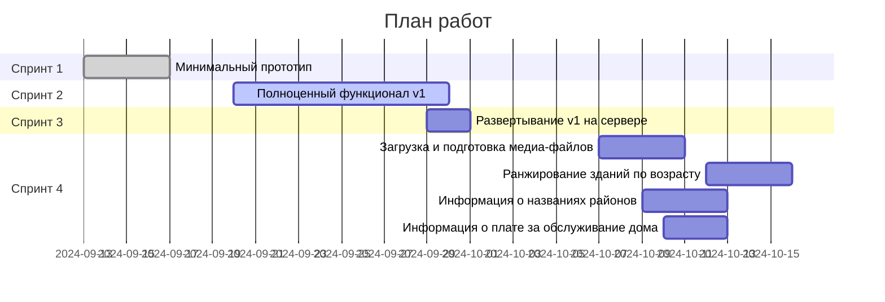

## Предложение

Я предлагаю реализацию проекта в три Спринта с проведением тестирования и внесением правок после каждого Спринта (занимает дополнительно 2-4 дня).

### Спринт 1: Минимальный прототип (13.09 → 19.09)

- Разработка ведется на моем тестовом сервере.
- Реализуемые функции:
  - Телеграм-бот.
  - Подключение к базе данных.
  - Команда `/start` — выводит описание бота и ссылку на Телеграм-канал.
  - Команда `/query` — предлагает ввести название здания и выводит наиболее похожие значения из базы данных.
  - Оформление ответов бота (язык, годы, проценты и т. д.).

**Срок выполнения**: 2-3 дня  
**Стоимость**: 10 000 руб.

### Спринт 2: Полноценный функционал (20.09 → 28.09)

- Поддержка двух языков: русский и английский.
- Меню с четырьмя опциями:
  1. Найти информацию о здании.
  2. Полезные ссылки.
  3. Поддержка.
  4. Выбор языка.
     Подробнее см. [ссылку 1.](https://docs.google.com/document/d/1p0YZGIBSoY0KONmXDj-ZaWNL0mxb9oyR/edit?usp=sharing&ouid=116826442056623255845&rtpof=true&sd=true)
- Поиск проектов по названию без явного вызова команды `/query`. Любое сообщение, не являющееся командой, будет интерпретироваться как название проекта для поиска.
- Если найдено более одного проекта, то пользователю предлагает меню из кнопок, где каждая кнопка имеет название проекта. При нажатии на кнопку, информация о соответствующем проекте выводится в следующем сообщение.
- Функция рассылки сообщений отдельным пользователям бота.
  - Для администратора будет добавлена кнопка для настройки рассылки: ввод текста сообщения → настройка времени и даты рассылки → запуск в очередь.
- Доступ к функциями бота (меню) предоставляется только пользователям канала @egorov_uae . Проверка происходит в режиме реального времени, при попытке доступа.

**Срок выполнения**: 5-8 дней  
**Стоимость**: 9000 руб.

### Спринт 3: Развертывание v1 на "боевом" сервере (29.09 → 02.10)

- К этому моменту необходимо определиться со способом эксплуатации бота:
  - **Вариант А**: Вы арендуете сервер, я устанавливаю на него бота. Вы самостоятельно следите за состоянием сервера.
  - **Вариант Б**: Я размещаю бота на своем сервере и сам слежу за его состоянием.

- В любом случае стоимость аренды сервера составит около 4-6 евро в месяц.

**Срок выполнения**: 1-2 дня

### Спринт 4: Разработка v2 (07.10 -> 14.10)

В данном спринте происходит разработка версии 2, которая включает функции загрузки и предобработки медиа-файлов, их интеграции с Google Диском и отправки через бота. Также добавлены ранжирование зданий по возрасту, вывод информации о названиях районов и плате за обслуживание.

#### 1. Загрузка и подготовка медиа-файлов

Для сервиса создается Google Диск, на котором будут храниться файлы для каждого объекта из базы данных проектов. Для каждого здания (проекта) создается отдельная директория. Документы по всем проектам из базы данных загружаются с помощью бота https://t.me/Brochurefinderbot на Google Диск. После загрузки выполняется следующая предобработка:
   - Удаление дубликатов файлов (по точному содержанию).
   - Переименование файлов с использованием ИИ для перефразирования названий.

Стоимость: 6500 руб.

#### 2. Поддержка медиа-файлов

Бот отправляет сопутствующие документы в форматах PDF, PNG, JPG, PPTX для каждого запроса через `/query`. Документы берутся из Google Диска.

Стоимость: 4000 руб.

#### 3. Функция ранжирования зданий по возрасту в выбранном районе

Реализуется функция ранжирования зданий по их возрасту в выбранном районе. Процесс работы функции:
   
   1. Пользователь начинает взаимодействие с системой.
   2. В меню появляется дополнительная кнопка "Районы" (Areas).
   3. Пользователь может выбрать один из популярных районов или ввести название района вручную:
   ```
    Dubai Marina

    Business Bay

    Downtown

    Creek Harbour

    Sobha Hartland

    City Walk
    
    Введи свой
   ```
   4. После выбора района, например, "Dubai Marina", система выводит список зданий, отсортированный по возрасту (от старых к новым).

  
Поиск осуществляется по колонке `master_project_en` в базе. В качестве результата пользователь получает таблицу с колонками:


|Название колонки в исходной таблице|Название колонки в таблице выдачи для пользователя|Примечание|
|--|--|--|
|project_name_id_Buildings&Tracsactions|Building name||
|project_end_date|Construction end date||
||How old is the building|Вычисляется в момент запроса|

Сортировка таблица выдачи по `How old is the building` от самых новых до самых старых по убыванию.

Стоимость: 1000 руб.

#### 4. Получение информации о названиях районов

После кнопки "Find building info" добавляется новая кнопка «Названия районов 🇦🇪->🇬🇧» / «Area names 🇦🇪->🇬🇧». При нажатии бот отправляет полную таблицу с названиями районов в формате Excel из приложения 3.

Стоимость: 1000 руб.

#### 5. Вывод информации о плате за обслуживание здания

В карточке объекта добавляется поле `service charge`. Необходимо:
- Подключить новый источник данных. Система запрашивает информацию об объекте из нескольких баз данных, используя название здания (проекта) в качестве общего ключа.

Стоимость: 2000 руб.

#### Итоговая стоимость

14 500 руб.



## Рекомендации

1. **Нечеткий поиск**: Учитывая, что пользователи могут не знать точное название здания, можно реализовать более гибкие стратегии поиска информации в базе данных на основе частичной информации.
2. **Использование ИИ**: Возможна реализация следующих улучшений:
   - Формирование читабельного текстового описания здания на основе строк из базы данных.
   - Автоматический поиск дополнительной информации о здании в интернете, последующее резюмирование и добавление к ответу с помощью ИИ.

## Приложения:

1. Описание меню: https://docs.google.com/document/d/1p0YZGIBSoY0KONmXDj-ZaWNL0mxb9oyR/edit?usp=sharing&ouid=116826442056623255845&rtpof=true&sd=true

2. Текстовки бота: https://github.com/worker-one/real_estate_telegram_bot/blob/main/src/real_estate_telegram_bot/conf/config.yaml

3. Таблица названий районов: https://docs.google.com/spreadsheets/d/178I5wqNblPNQl0cPIxR4IkphnPqkTFtw/edit?usp=sharing&ouid=116826442056623255845&rtpof=true&sd=true
