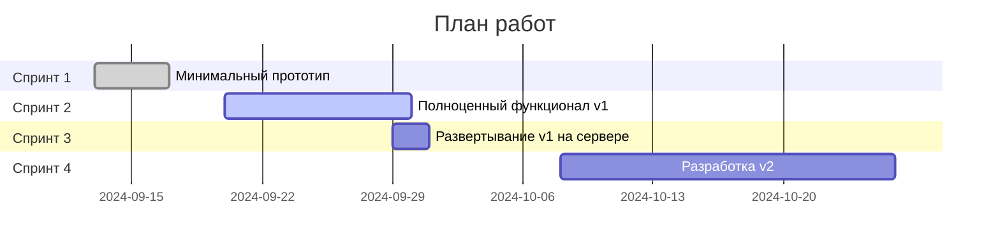

## Предложение

Я предлагаю реализацию проекта в три Спринта с проведением тестирования и внесением правок после каждого Спринта (занимает дополнительно 2-4 дня).

### Спринт 1: Минимальный прототип (13.09 → 19.09)

- Разработка ведется на моем тестовом сервере.
- Реализуемые функции:
  - Телеграм-бот.
  - Подключение к базе данных.
  - Команда `/start` — выводит описание бота и ссылку на Телеграм-канал.
  - Команда `/query` — предлагает ввести название здания и выводит наиболее похожие значения из базы данных.
  - Оформление ответов бота (язык, годы, проценты и т. д.).

**Срок выполнения**: 2-3 дня  
**Стоимость**: 10 000 руб.

### Спринт 2: Полноценный функционал (20.09 → 28.09)

- Поддержка двух языков: русский и английский.
- Меню с четырьмя опциями:
  1. Найти информацию о здании.
  2. Полезные ссылки.
  3. Поддержка.
  4. Выбор языка.
     Подробнее см. [ссылку 1.](https://docs.google.com/document/d/1p0YZGIBSoY0KONmXDj-ZaWNL0mxb9oyR/edit?usp=sharing&ouid=116826442056623255845&rtpof=true&sd=true)
- Поиск проектов по названию без явного вызова команды `/query`. Любое сообщение, не являющееся командой, будет интерпретироваться как название проекта для поиска.
- Если найдено более одного проекта, то пользователю предлагает меню из кнопок, где каждая кнопка имеет название проекта. При нажатии на кнопку, информация о соответствующем проекте выводится в следующем сообщение.
- Функция рассылки сообщений отдельным пользователям бота.
  - Для администратора будет добавлена кнопка для настройки рассылки: ввод текста сообщения → настройка времени и даты рассылки → запуск в очередь.
- Доступ к функциями бота (меню) предоставляется только пользователям канала @egorov_uae . Проверка происходит в режиме реального времени, при попытке доступа.

**Срок выполнения**: 5-8 дней  
**Стоимость**: 9000 руб.

### Спринт 3: Развертывание v1 на "боевом" сервере (29.09 → 02.10)

- К этому моменту необходимо определиться со способом эксплуатации бота:
  - **Вариант А**: Вы арендуете сервер, я устанавливаю на него бота. Вы самостоятельно следите за состоянием сервера.
  - **Вариант Б**: Я размещаю бота на своем сервере и сам слежу за его состоянием.

- В любом случае стоимость аренды сервера составит около 4-6 евро в месяц.

**Срок выполнения**: 1-2 дня

### Спринт 4: Разработка v2 (07.10 -> 14.10)

На данном Спринте разрабатывается версия 2 со следующими новыми функциями:

#### Загрузка и подготовка медиа файлов

Для сервиса создается гугл диск, на котором хранятся файлы для каждого записи из базы данных проектов. Для каждого здания (проекта) создается отдельная директория. Из бота https://t.me/Brochurefinderbot выкачиваются документы в гугл диск по всем проектам из базы данных. Над скаченными документами выполняется следующая предобработка:
    - удаление дубликатов файлов (по точному содержанию).
    - переименнование с помощью перефразирования с использованием ИИ.

Стоимость: 6500р

#### Подержка медиа файлов

Бот отправляет сопуствующие документы в формате pdf, png, jpg, pptx для каждого запроса через `/query` . Документы берутся из гугл диска.

Стоимость: 4000р

#### Функция ранжирования зданий в выбранном районе по их возрасту

Функция ранжирования зданий в выбранном районе по их возрасту. Процесс работает следующим образом:

    1. Пользователь начинает взаимодействие с системой.
    2. В меню появляется дополнительная кнопка, связанная с районами (Areas).
    3. Пользователь может выбрать один из 10 популярных районов или ввести вручную другой район, если его нет в списке.
    4. После выбора района, например, "Dubai Marina", система отображает список зданий в этом районе, отсортированный по возрасту (от самых старых к новым).
  
Информация о районе здания берётся из базы данных зданий.

Стоимость: 1000р

#### Получение информации о названих районов

После кнопки find building info появляется новая кнопка «Area names 🇦🇪->🇬🇧» / «Названия районов 🇦🇪->🇬🇧», по нажатию на которую бот отправляет полностью таблицу в формате эксель из приложения 3.

Стоимость: 1000р

#### Вывод информации о плате за обслуживание дома

В карточе объекта добавляется поле `service charge`. Задачи:

- Подключение нового источника данных, система запрашивает информацию об объекте из нескольких баз данных используя в качестве общего ключа название здание (проекта).

Стоимость: 2000р

#### Финальная стоимость

14500 руб

```mermaid
gantt
    dateFormat  YYYY-MM-DD
    title План работ
    section Спринт 1
    Минимальный прототип        :done, 2024-09-13, 4d
    section Спринт 2
    Полноценный функционал v1      :active, 2024-09-20, 10d
    section Спринт 3
    Развертывание v1 на сервере    :2024-09-29, 2d
    section Спринт 4
    Разработка v2    :2024-10-08, 18d
```

## Рекомендации

1. **Нечеткий поиск**: Учитывая, что пользователи могут не знать точное название здания, можно реализовать более гибкие стратегии поиска информации в базе данных на основе частичной информации.
2. **Использование ИИ**: Возможна реализация следующих улучшений:
   - Формирование читабельного текстового описания здания на основе строк из базы данных.
   - Автоматический поиск дополнительной информации о здании в интернете, последующее резюмирование и добавление к ответу с помощью ИИ.

## Приложения:

1. Описание меню: https://docs.google.com/document/d/1p0YZGIBSoY0KONmXDj-ZaWNL0mxb9oyR/edit?usp=sharing&ouid=116826442056623255845&rtpof=true&sd=true

2. Текстовки бота: https://github.com/worker-one/real_estate_telegram_bot/blob/main/src/real_estate_telegram_bot/conf/config.yaml

3. Таблица названий районов: https://docs.google.com/spreadsheets/d/178I5wqNblPNQl0cPIxR4IkphnPqkTFtw/edit?usp=sharing&ouid=116826442056623255845&rtpof=true&sd=true
